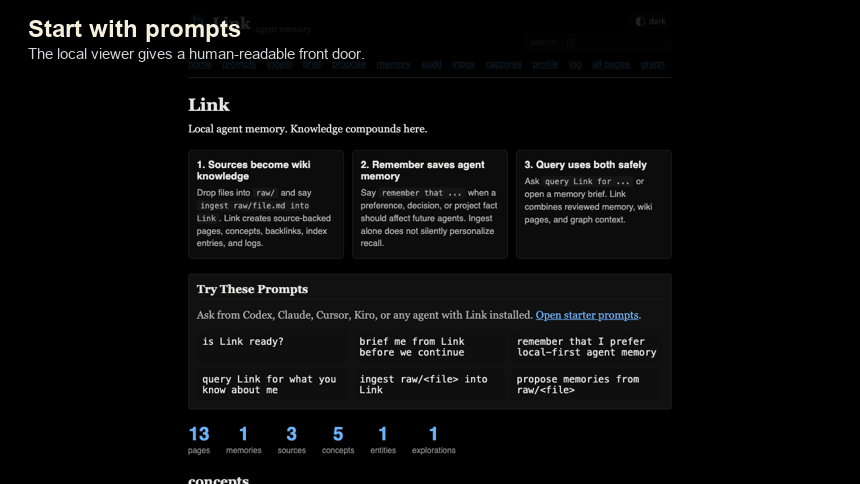
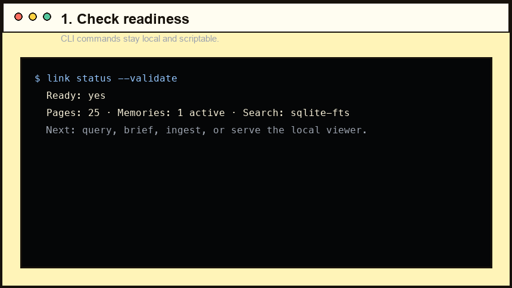
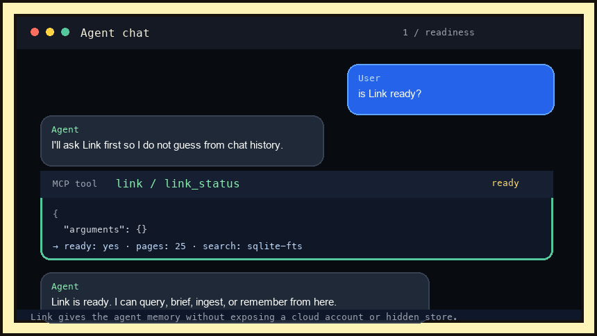

<p align="center">
  
</p>

# Link

**Local, source-backed memory for LLM agents.**

Link gives Codex, Claude, Cursor, Kiro, VS Code, Copilot, and other MCP clients
the same durable memory about you and your work. It stays on your machine as
plain Markdown, with sources, backlinks, graph context, review state, and an
audit trail you can inspect.

It follows Andrej Karpathy's
[LLM Wiki pattern](https://gist.github.com/karpathy/442a6bf555914893e9891c11519de94f):
keep knowledge outside the chat window, make claims inspectable, and let context
compound over time.

[](https://github.com/gowtham0992/link)
[](https://github.com/gowtham0992/link/actions/workflows/ci.yml)
[](https://registry.modelcontextprotocol.io/?q=io.github.gowtham0992%2Flink)
[](https://pypi.org/project/link-mcp/)

[Product site](https://gowtham0992.github.io/link/) ·
[First 10 minutes](https://gowtham0992.github.io/link/getting-started.html) ·
[Why Link?](https://gowtham0992.github.io/link/why-link.html) ·
[Web UI](https://gowtham0992.github.io/link/ui.html) ·
[MCP setup](https://gowtham0992.github.io/link/mcp.html) ·
[CLI](https://gowtham0992.github.io/link/cli.html) ·
[Security](SECURITY.md) ·
[Changelog](CHANGELOG.md)

## Why It Exists

Most agent sessions start from zero. You re-explain preferences, repo decisions,
project constraints, and why something matters. Link turns that repeated context
into local memory agents can query.

| Pain | Link's answer |
|------|---------------|
| Agents forget you between sessions. | Save reviewed preferences, decisions, facts, and project context. |
| Notes are private or messy. | Keep raw sources local, then turn them into source-backed Markdown. |
| Context windows are expensive. | Return compact query packets with provenance and follow-up actions. |
| Memory needs trust. | Every page and memory can be inspected, reviewed, archived, or forgotten. |

## Quick Start

Run the demo first. It creates a complete local wiki with raw sources, wiki
pages, one starter memory, graph data, and query packets ready to inspect.

```bash
git clone https://github.com/gowtham0992/link.git
cd link
python3 link.py demo
python3 link.py serve link-demo
```

Open:

```text
http://127.0.0.1:3000
http://127.0.0.1:3000/graph
```

The web viewer is for local use only. It binds to `127.0.0.1`, has no user
accounts or authentication, and should not be exposed to the internet unless you
add your own auth layer.

Try the value loop:

```bash
python3 link.py query "why does Link help agents?" link-demo --budget small
python3 link.py brief "working on agent memory" link-demo
python3 link.py benchmark "agent memory" link-demo
python3 link.py status --validate link-demo
```

The generated demo is the public proof wiki. The repo's root `wiki/` directory
is only a scaffold for local development and personal testing. Generated content
inside `wiki/`, `raw/`, and `link-demo/` is ignored by git so personal memory is
not published by accident.

## Three Ways To Use Link

Pick the surface that matches how you work. They all read and write the same
local Markdown wiki.

<table>
  <tr>
    <td width="33%">
      <strong>Web UI</strong><br>
      Review memory, ingest, graph, audits, captures, and explanations in a local viewer.<br><br>
      <a href="https://gowtham0992.github.io/link/ui.html"></a>
    </td>
    <td width="33%">
      <strong>CLI</strong><br>
      Script readiness, query packets, briefs, validation, backup, benchmark, and repair.<br><br>
      <a href="https://gowtham0992.github.io/link/cli.html"></a>
    </td>
    <td width="33%">
      <strong>MCP</strong><br>
      Let Codex, Claude, Cursor, Kiro, VS Code, Copilot, and other agents recall memory.<br><br>
      <a href="https://gowtham0992.github.io/link/mcp.html"></a>
    </td>
  </tr>
</table>

## Install For Your Agent

Run one installer from the cloned checkout:

```bash
bash integrations/codex/install.sh
bash integrations/kiro/install.sh
bash integrations/claude-code/install.sh
bash integrations/cursor/install.sh
bash integrations/copilot/install.sh
bash integrations/vscode/install.sh
bash integrations/antigravity/install.sh
```

Installers create or update `~/link`, install or upgrade `link-mcp`, write
lightweight agent instructions, and preserve existing wiki data on reinstall.
Use `--project` when a repo needs separate project memory.

Then ask your agent:

```text
is Link ready?
brief me from Link before we continue
ingest raw/notes.md into Link
remember that I prefer short release notes
query Link for the release process
what does Link remember about local personal memory?
```

<details>
<summary>MCP-only install</summary>

```bash
python3 -m pip install --upgrade link-mcp
```

```json
{
  "mcpServers": {
    "link": {
      "command": "python3",
      "args": ["-m", "link_mcp", "--wiki", "~/link/wiki"]
    }
  }
}
```

On macOS/Homebrew Python, if pip reports `externally-managed-environment`, use a
dedicated venv:

```bash
python3 -m venv ~/.link-mcp-venv
~/.link-mcp-venv/bin/python -m pip install --upgrade pip link-mcp
```

Full setup: [MCP guide](https://gowtham0992.github.io/link/mcp.html).
</details>

## How Link Works

Link has one simple rule:

```text
Sources become wiki knowledge.
Explicit "remember" becomes agent memory.
Queries use both.
```

The storage model is plain and inspectable:

| Layer | What lives there |
|-------|------------------|
| `raw/` | Original notes, transcripts, articles, PDFs, screenshots, and project files. |
| `wiki/` | Source-backed pages, concepts, entities, explorations, comparisons, and memories. |
| MCP tools | Compact packets agents can use without dumping the whole wiki into context. |

If a raw file was already ingested and later edited, `link ingest-status` marks it
as stale and tells your agent to refresh the existing source page instead of
creating a duplicate.

## What Agents Get

- `query_link`: an answer-ready packet with relevant memories, pages, graph
  neighborhood, reasons for selection, budget limits, and follow-up actions.
- `memory_brief`: a compact pre-work brief with user/project preferences,
  active context, review warnings, and safe memory-use rules.
- `ingest_status`: exact next steps for raw files, including source safety,
  stale ingest detection, validation, and memory proposal guidance.
- `remember_memory`: durable local memory with duplicate/conflict checks,
  review state, provenance, and audit logging.
- `explain_memory`: why a memory exists, what it links to, whether it is ready
  for recall, and what needs review.

## Agent Contract

Agents should use Link in this order:

1. `link_status` to check readiness and safe next actions.
2. `starter_prompts` when the user asks what to try first.
3. `ingest_status` before touching raw sources.
4. `query_link` for compact answer-ready context.
5. `memory_brief` before longer work.
6. `get_graph_summary` when graph context is useful but the full graph would be noisy.
7. `backup_wiki` before broad repair or migration work.
8. `validate_wiki` after ingest or broad wiki edits.

Full MCP tool list: [MCP setup](https://gowtham0992.github.io/link/mcp.html).

## Privacy And Safety

Link is local-first:

- No telemetry.
- No hosted backend.
- No external API calls from `serve.py` or `link-mcp`.
- Raw sources and generated wiki pages are ignored by git by default.
- `link backup` excludes `raw/` unless you explicitly pass `--include-raw`.
- Secret-looking values are detected in raw sources, captures, and release
  hygiene checks.
- The local web server binds to `127.0.0.1` and is not meant to be exposed to
  the internet without additional auth.

Before sharing a repo, demo, or wiki:

```bash
python3 link.py doctor
python3 link.py validate
python3 scripts/check_release_hygiene.py
```

More detail: [Security guide](https://gowtham0992.github.io/link/security.html).

## Documentation

| Need | Go here |
|------|---------|
| Run Link for the first time | [First 10 minutes](https://gowtham0992.github.io/link/getting-started.html) |
| Decide whether Link fits | [Why Link?](https://gowtham0992.github.io/link/why-link.html) |
| Use the local viewer | [Web UI](https://gowtham0992.github.io/link/ui.html) |
| Understand raw/wiki/memory | [Concepts](https://gowtham0992.github.io/link/concepts.html) |
| Configure MCP | [MCP setup](https://gowtham0992.github.io/link/mcp.html) |
| Find a command | [CLI reference](https://gowtham0992.github.io/link/cli.html) |
| Use local HTTP endpoints | [HTTP API](https://gowtham0992.github.io/link/api.html) |
| Review security boundaries | [Security model](https://gowtham0992.github.io/link/security.html) |
| Fix setup issues | [Troubleshooting](https://gowtham0992.github.io/link/troubleshooting.html) |

## Contributing

Contributions should come through pull requests targeting `main`. The `develop`
branch is a maintainer integration branch for larger release work before it is
proposed to `main`.

Before opening a PR:

```bash
python3 -m ruff check .
python3 -m unittest discover -s tests
python3 scripts/check_release_hygiene.py
python3 scripts/check_runtime_duplication.py
python3 scripts/check_tool_contract.py
git diff --check
```

Full contributor guide: [Contributing](https://gowtham0992.github.io/link/contributing.html).

Do not include personal wiki data, raw sources, registry tokens, `.env` files, or
local MCP credentials in a PR.

If Link helps your agents remember better, [star it on GitHub](https://github.com/gowtham0992/link)
so more people can find it.
