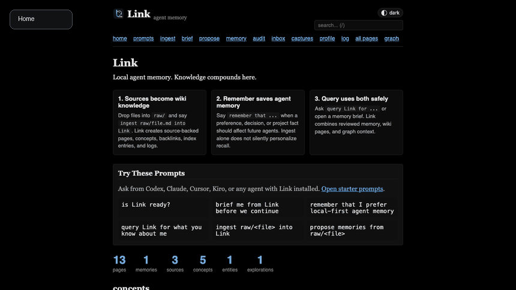
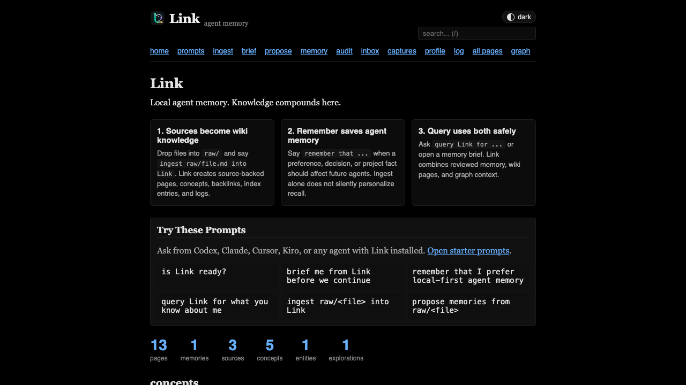
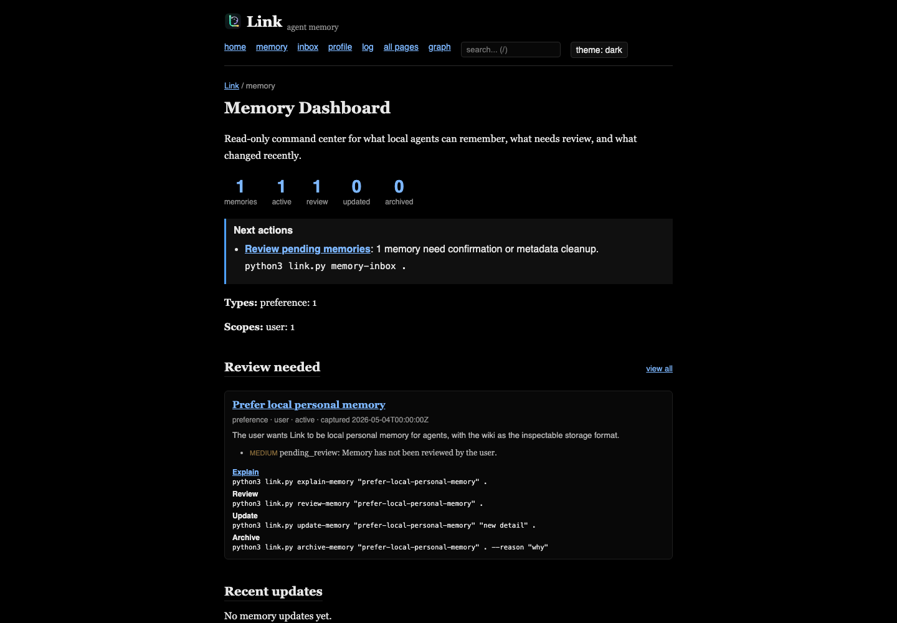
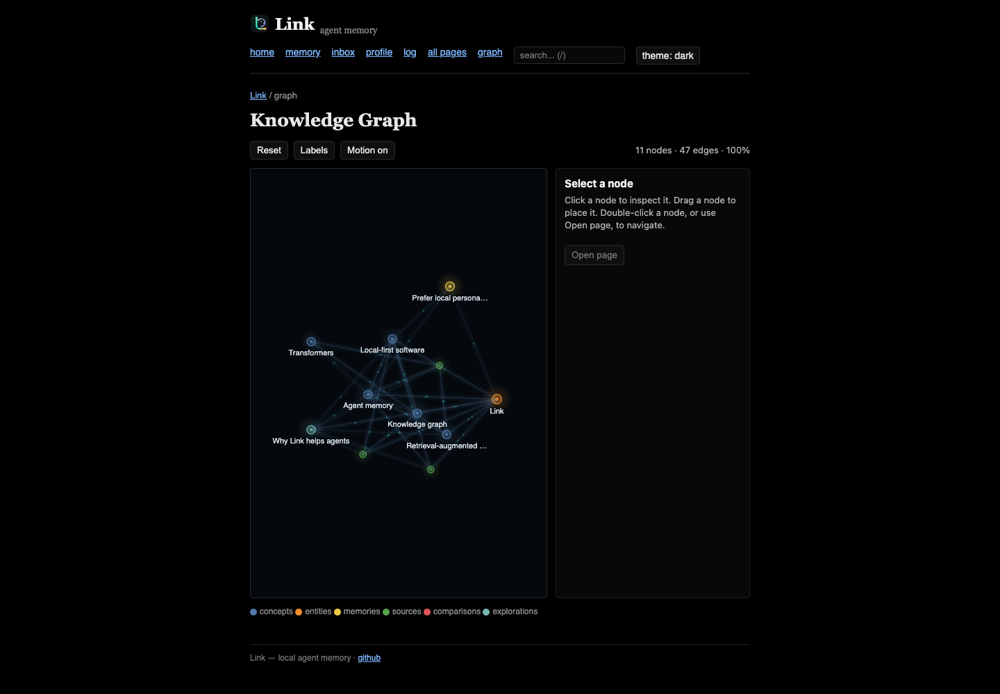
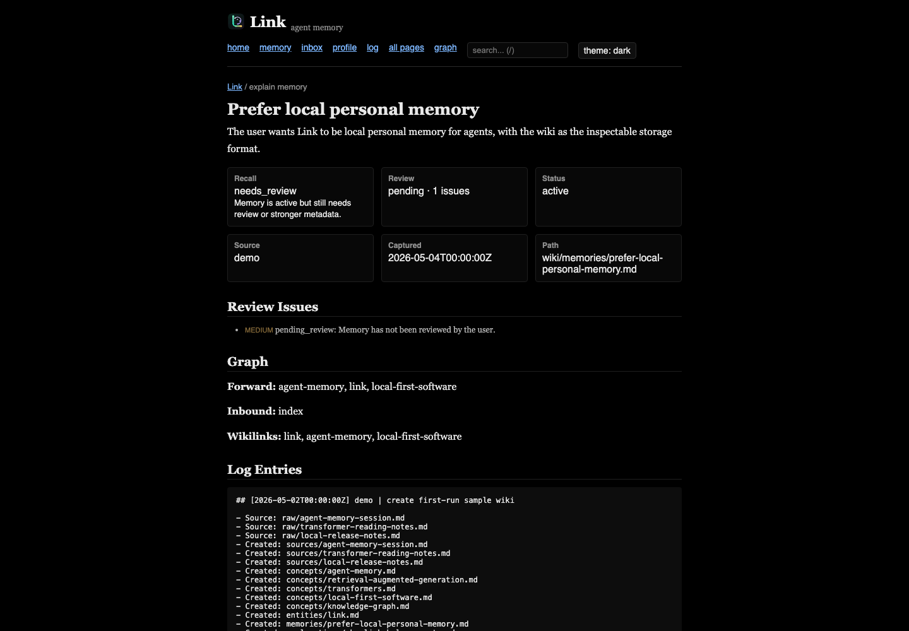

<p align="center">
  
</p>

# Link

**Local, source-backed memory for LLM agents.**

Link gives Codex, Claude, Cursor, Kiro, VS Code, Copilot, and other MCP clients
the same durable memory about you and your work. The memory stays on your
machine as plain Markdown, with sources, backlinks, graph context, and an audit
trail you can inspect.

It follows Andrej Karpathy's [LLM Wiki pattern](https://gist.github.com/karpathy/442a6bf555914893e9891c11519de94f):
keep knowledge outside the chat window, make claims inspectable, and let context
compound over time.

[](https://github.com/gowtham0992/link)
[](https://github.com/gowtham0992/link/actions/workflows/ci.yml)
[](https://registry.modelcontextprotocol.io/?q=io.github.gowtham0992%2Flink)
[](https://pypi.org/project/link-mcp/)

Release notes: [CHANGELOG.md](CHANGELOG.md)

<p align="center">
  
</p>

## Why Link

Most agent sessions start from zero. You re-explain preferences, repo decisions,
project constraints, and why something matters. Link makes that context durable:

- **Personal memory:** preferences, decisions, facts, and project context agents
  can recall later.
- **Source-backed wiki:** raw notes become readable Markdown pages with citations.
- **Graph context:** pages know what links in, what links out, and what sits nearby.
- **MCP-native:** every local agent can use the same memory layer.
- **Local-first:** no hosted backend, no telemetry, no cloud lock-in.
- **Inspectable:** Markdown files, backlinks, logs, and review states are yours.

## Quick Start

Start with the finished demo. It already has raw sources, wiki pages, one local
memory, backlinks, graph data, and a query packet ready to inspect.

```bash
git clone https://github.com/gowtham0992/link.git
cd link
python3 link.py demo
python3 link.py serve link-demo
```

Open:

- `http://localhost:3000`
- `http://localhost:3000/brief`
- `http://localhost:3000/propose`
- `http://localhost:3000/memory`
- `http://localhost:3000/audit`
- `http://localhost:3000/captures`
- `http://localhost:3000/graph`

Then check the demo:

```bash
python3 link.py query "why does Link help agents?" link-demo --budget small
python3 link.py brief "working on agent memory" link-demo
python3 link.py memory-audit link-demo
python3 link.py status --validate link-demo
```

The first query should return a compact packet with a relevant memory, the best
wiki page, nearby graph context, and agent guidance. The demo also writes
`link-demo/START_HERE.md` with the exact prompts and checks to try.

After the demo:

| Goal | Go to |
|------|-------|
| Use Link with your agent | [First 10 Minutes](#first-10-minutes) |
| Understand the storage model | [Sources, Wiki, And Memory](#sources-wiki-and-memory) |
| Configure only MCP | [I Want MCP Only](#i-want-mcp-only) |
| Contribute to Link | [Contributing](#contributing) |

## What You Get

### Wiki Home

Browse pages by type, search locally, and open the same Markdown pages your
agents use.

<p align="center">
  
</p>

### Memory Dashboard

See what agents can remember, what needs review, and what changed recently.

<p align="center">
  
</p>

### Memory Brief

Prime an agent before work with relevant memories, review warnings, raw capture
status, and safe memory rules.

### Memory Audit

Check memory health in one place: review backlog, saved raw captures,
secret-warning captures, and the next safe commands to run.

### Raw Capture Inbox

Review proposal-only session notes before they become durable memory. Secret-like
values are redacted in snippets and called out for local cleanup.

### Knowledge Graph

Inspect relationships between source pages, concepts, entities, explorations, and
memories. Use fullscreen, search, type filters, neighborhood depth, and automatic
motion capping for large wikis. Dragging a node places it; double-clicking opens it.

<p align="center">
  
</p>

### Explain Memory

Every memory can explain why it exists, whether it is review-ready, and what
source or log evidence supports it.

<p align="center">
  
</p>

## Sources, Wiki, And Memory

Link has one simple rule:

```text
Sources become wiki knowledge.
Explicit "remember" becomes agent memory.
Queries use both.
```

Raw files do not silently personalize future agents. When you drop a source into
`raw/` and ask Link to ingest it, Link creates source-backed wiki pages, updates
concept/entity pages, rebuilds backlinks, and validates the graph. When you say
`remember ...`, Link saves durable memory that future agents may use as user or
project context.

Use these three moves:

```text
ingest raw/file.md into Link
remember that I prefer short release notes
query Link for the release process
```

If a source might contain preferences or decisions, ask for proposals first:

```text
propose memories from raw/file.md
```

Then approve only the memories you want agents to carry forward. You can also
open `/propose`, paste notes, or jump there from a pending raw file on `/ingest`.
Link returns proposal-only candidates. Nothing is written until you approve a
memory through your agent or the CLI.

## First 10 Minutes

This path turns one real note into local agent memory.

### 1. Install Link For Your Agent

From the cloned `link/` checkout:

```bash
bash integrations/codex/install.sh
```

Pick the installer that matches your agent:

```bash
bash integrations/kiro/install.sh          # Kiro
bash integrations/claude-code/install.sh   # Claude Code
bash integrations/codex/install.sh         # Codex
bash integrations/cursor/install.sh        # Cursor
bash integrations/copilot/install.sh       # Copilot
bash integrations/vscode/install.sh        # VS Code
bash integrations/antigravity/install.sh   # Google Antigravity
```

This creates `~/link/`, installs or upgrades `link-mcp`, installs a short
`link` command, writes lightweight agent instructions, and leaves existing wiki
data untouched on reinstall.

Use `--project` for a repo-local Link install. Project-scoped memories then get a
project key, and recall/profile/brief include global user memory plus that
project's memory.

### 2. Add One Source

```bash
cat > ~/link/raw/first-memory.md <<'EOF'
---
title: "First Link memory"
source_type: note
date_captured: 2026-05-04
---

# First Link memory

I am testing Link as local personal memory for agents.
Raw notes stay local. The agent turns them into source-cited wiki pages.
EOF
```

Check what is pending:

```bash
link ingest-status
```

`link ingest-status` prints the exact agent prompt to use for the next raw file
and the follow-up checks to run after ingest.

### 3. Save One Direct Memory

You can ask your agent naturally:

```text
remember that I am testing Link as local personal memory for agents
brief me from Link before we continue
what does Link remember about local personal memory?
```

Or use the local command:

```bash
link remember "I am testing Link as local personal memory for agents." --type preference --scope user --tags onboarding
link brief "local personal memory"
link recall "local personal memory"
link profile
link memory-audit
```

### 4. Ask Your Agent To Ingest

In your agent chat:

```text
ingest raw/first-memory.md into Link
```

The agent reads `~/link/LINK.md`, creates a source page under `wiki/sources/`,
creates or updates concept/entity pages, updates `wiki/index.md`, appends
`wiki/log.md`, rebuilds backlinks, and validates the generated pages.

### 5. Verify The Loop

```bash
link doctor --fix
link status --validate
link ingest-status
link validate
link memory-audit
link verify-mcp
```

Then ask your MCP-enabled agent:

```text
query Link for first Link memory
```

If the answer comes from Link, your local memory loop is working.

## How Link Works

```text
raw sources -> agent ingest -> Markdown wiki -> backlinks/graph -> MCP recall
                         \
                          -> direct memories -> review/update/archive
```

| Layer | Purpose |
|-------|---------|
| `raw/` | Immutable sources: notes, papers, articles, transcripts, images, PDFs. |
| `wiki/sources/` | One source page per ingested raw file. |
| `wiki/concepts/`, `wiki/entities/`, `wiki/explorations/` | Synthesized knowledge pages with source citations. |
| `wiki/memories/` | Preferences, decisions, project facts, and user context. |
| `wiki/_backlinks.json` | Reverse and forward graph index for HTTP and MCP. |
| `wiki/log.md` | Append-only audit trail of ingest, memory, and maintenance operations. |

You own the files. Agents maintain them.

## Install Paths

### I Want To Try Link

```bash
git clone https://github.com/gowtham0992/link.git
cd link
python3 link.py demo
python3 link.py serve link-demo
```

### I Want My Agent To Use Link

Run the installer for your agent:

```bash
bash integrations/codex/install.sh
```

Re-run the same installer after `git pull` to refresh code, instructions, and
MCP setup without replacing your wiki pages.

Global installs also create `~/.local/bin/link`, so local checks become
`link status --validate`, `link query "..."`, and `link brief "..."`. If your
shell cannot find `link`, add `~/.local/bin` to the front of `PATH` once.

The installers try the current `python3` first. If that Python is externally
managed, they create `~/.link-mcp-venv`, install `link-mcp` there, and register
MCP with that venv Python.

### I Want MCP Only

Install `link-mcp` and point it at a wiki:

```bash
python3 -m pip install --upgrade link-mcp
```

```json
{
  "mcpServers": {
    "link": {
      "command": "python3",
      "args": ["-m", "link_mcp", "--wiki", "~/link/wiki"]
    }
  }
}
```

On macOS/Homebrew Python, if pip reports `externally-managed-environment`, use a
dedicated venv:

```bash
python3 -m venv ~/.link-mcp-venv
~/.link-mcp-venv/bin/python -m pip install --upgrade pip link-mcp
```

Then use that Python in your MCP config:

```json
{
  "mcpServers": {
    "link": {
      "command": "/Users/YOU/.link-mcp-venv/bin/python",
      "args": ["-m", "link_mcp", "--wiki", "/Users/YOU/link/wiki"]
    }
  }
}
```

## Daily Workflow

Most days, you only need three habits: add sources, save explicit memories, and
ask Link for a brief before important work.

Add source material:

```bash
cp notes.md ~/link/raw/
link ingest-status
```

Ask your agent:

```text
ingest raw/notes.md into Link
```

Remember preferences and decisions directly:

```bash
link remember "User prefers feature branches for Link work." --title "Prefer feature branches" --type preference --scope project --project link
link recall "branch preference" --project link
link explain-memory prefer-feature-branches
link update-memory prefer-feature-branches "Use focused branches for public PR work." --project link
link review-memory prefer-feature-branches --note "confirmed"
```

If a new memory may contradict an active memory, Link reports conflict candidates
instead of saving silently. Update or archive the old memory, or use
`--allow-conflict` only when both memories should coexist.

For project installs, Link infers the project key from the repo directory. For a
global `~/link` wiki, pass `--project <slug>` when saving or recalling repo
specific memories.

Capture longer session notes without silently writing memories:

```bash
link capture-session session-notes.md --project link
```

This stores the note under `raw/memory-captures/`, logs the capture locally, and
returns memory proposals for human approval. Capture results warn on
secret-looking pasted values so you can redact the local raw note.

Review saved captures before approving or deleting them:

```bash
link capture-inbox --project link
```

Approve one proposal when it is right:

```bash
link accept-capture raw/memory-captures/<capture>.md --index 1
```

Redact a capture if Link warns about pasted secrets:

```bash
link redact-capture raw/memory-captures/<capture>.md
link delete-capture raw/memory-captures/<capture>.md --confirm
```

Maintain the wiki:

```bash
link backup
link doctor --fix
link memory-audit
link rebuild-index
link rebuild-backlinks
link validate
link verify-mcp
```

View the wiki:

```bash
link serve
```

Obsidian also works: open `~/link/wiki/` as a vault.

## MCP Tools

Link is listed on the [official MCP Registry](https://registry.modelcontextprotocol.io/?q=io.github.gowtham0992%2Flink)
as `io.github.gowtham0992/link`.

Most agents should start with:

| Tool | Use it when |
|------|-------------|
| `link_status` | You are connecting to Link or troubleshooting setup and need version, readiness, counts, validation summary, and safe next actions. |
| `migrate_wiki` | `link_status` reports a missing or old schema marker and you need a safe, idempotent local migration. |
| `ingest_status` | The user dropped files into `raw/` or asks to ingest, and you need pending raw files plus the next prompt/checks and guided ingest plan. |
| `query_link` | You need one compact, answer-ready packet that combines relevant memory, ranked wiki results, graph context, provenance, budget limits, estimated packet size, and follow-up actions without reading the whole wiki. |
| `validate_wiki` | You just ingested sources or substantially edited pages and need to verify page shape, links, and backlink freshness before reporting done. |
| `backup_wiki` | You are about to run broad repair work or risky local wiki edits and want a local `.link-backups/` archive first. |
| `memory_brief` | You are starting a session or task and need Link to prime the agent with relevant memory, review warnings, and saved capture status. |
| `memory_audit` | You need one read-only health report for memory review backlog, raw captures, and next actions. |
| `memory_profile` | You need to know what Link remembers about the user/project. |
| `memory_inbox` | You need review items with the safest next action for each memory. |
| `recall_memory` | You need preferences, decisions, facts, or project context with recall readiness. |
| `get_context` | You need a topic plus its graph neighborhood. |
| `search_wiki` | You need ranked search across the wiki. |
| `explain_memory` | You need provenance and review state for a memory. |
| `remember_memory` | The user explicitly approves saving a durable memory. |
| `propose_memories` | You want memory candidates from chat/session notes without writing. |
| `capture_session` | You want to save long session notes locally before approving memory writes; results include secret-looking content warnings. |
| `capture_inbox` | You want to review saved raw captures, redacted snippets, warnings, and next actions. |
| `accept_capture` | The user approves one proposal from a saved raw capture. |
| `redact_capture` | The user approves redacting secret-looking values from a saved raw capture. |
| `delete_capture` | The user explicitly confirms deleting a saved raw capture. |
| `forget_memory` | The user explicitly confirms Link should permanently delete a memory. |
| `rebuild_index` | You ingested or edited pages and need `wiki/index.md` to reflect the current wiki. |

Full tool set: `link_status`, `migrate_wiki`, `ingest_status`, `query_link`, `validate_wiki`, `backup_wiki`, `memory_brief`, `memory_audit`, `memory_profile`, `memory_inbox`, `review_memory`,
`explain_memory`, `search_wiki`, `recall_memory`, `remember_memory`,
`propose_memories`, `capture_session`, `capture_inbox`, `accept_capture`, `redact_capture`, `delete_capture`,
`update_memory`, `archive_memory`, `restore_memory`, `forget_memory`,
`get_context`, `get_pages`, `get_backlinks`, `get_graph`, `rebuild_index`, `rebuild_backlinks`.

Memory write tools return `duplicate_candidates` or `conflict_candidates` when
the safer next step is review, update, or archive instead of creating another
memory page.

Project-aware tools accept an optional `project` argument. When set, Link returns
broad user/global memory plus memories for that project, while keeping memories
from other explicit projects out of recall and duplicate/conflict checks.

## HTTP API

`serve.py` exposes Link locally while the web viewer is running.

Local use only: `serve.py` binds to `127.0.0.1`, rejects host/bind flags, and
has no authentication. Do not expose it to the internet without adding auth. HTTP write actions require
`X-Link-Local-Action: true`; responses include `X-Link-API-Version`; proposal analysis does not write pages.

Common endpoints:

| Endpoint | Description |
|----------|-------------|
| `GET /api/status?validate=true` | Readiness summary with page/memory counts, optional validation summary, and safe next actions. |
| `GET /api/ingest-status` | Raw ingest state with pending files, graph health, exact agent prompt, guided plan, and follow-up commands. |
| `GET /api/pages` | All pages with title, type, tags, aliases, maturity, and TLDR. |
| `GET /api/memory-dashboard?project=<slug>` | Read-only memory dashboard data, including saved raw captures and secret-warning counts. |
| `GET /api/memory-brief?q=<task>&project=<slug>` | Startup memory context for an agent, including relevant memories, review warnings, and capture status. |
| `GET /api/memory-audit?project=<slug>` | Read-only memory health report with backlog, capture risks, and next actions. |
| `GET /api/memory-profile?project=<slug>` | Counts and recent memories for the local memory profile. |
| `GET /api/memory-inbox?project=<slug>` | Memories that need review or metadata cleanup. |
| `GET /api/capture-inbox?project=<slug>` | Saved raw captures with redacted snippets, secret-warning labels, and review commands. |
| `GET /api/explain-memory?memory=<name>` | Provenance, lifecycle, graph links, review state, and recall readiness. |
| `GET /api/query-link?q=<query>&budget=small\|medium\|large` | Compact context packet with relevant memory, ranked wiki results, graph context, provenance, budget reports with estimated size, follow-up actions, and selection reasons. |
| `GET /api/validate?strict=true` | Validate generated wiki pages; failed gates return HTTP 422 with structured findings. |
| `GET /api/proposal-sources` | Local raw text sources that can be loaded into `/propose`; snippets are redacted when secret-looking values are present. |
| `GET /api/proposal-source?path=raw/file.md` | Load one safe raw text source into the proposal workflow; secret-warning files are refused until redacted. |
| `POST /api/propose-memories` | Returns memory proposals from pasted or loaded notes without writing pages; used by `/propose`. |
| `POST /api/remember-memory` | Header `X-Link-Local-Action: true`; saves an explicitly approved memory through duplicate/conflict-safe core writes. |
| `POST /api/update-memory` | Header `X-Link-Local-Action: true`; merges an approved proposal into an existing memory and resets review. |
| `POST /api/review-memory` | Header `X-Link-Local-Action: true`; JSON `{ "memory": "name", "note": "optional" }`; marks a memory reviewed. |
| `POST /api/archive-memory` | Header `X-Link-Local-Action: true`; JSON `{ "memory": "name", "reason": "optional" }`; hides a memory from default recall. |
| `POST /api/restore-memory` | Header `X-Link-Local-Action: true`; JSON `{ "memory": "name" }`; restores an archived memory to active recall. |
| `GET /api/search?q=<query>` | Ranked search by title, alias, tag, TLDR, and full text. |
| `GET /api/context?topic=<topic>` | Best matching page plus inbound and forward graph links. |
| `GET /api/graph` | Nodes and edges for graph visualization. |
| `POST /api/rebuild-backlinks` | Header `X-Link-Local-Action: true`; rebuild `_backlinks.json` by scanning wikilinks. |
| `POST /api/rebuild-index` | Header `X-Link-Local-Action: true`; regenerate `wiki/index.md` from current pages. |

## Command Reference

After a global installer run, use `link <command>` from any directory. From a
repo-local or source checkout, use `python3 link.py <command>` in that directory.

| Command | What it does |
|---------|-------------|
| `link init [dir]` | Create or repair a normal Link wiki without demo content. |
| `link serve [dir] [--port 3000]` | Start the local web viewer for a Link wiki. |
| `link status [--validate]` | Show local readiness, page/memory counts, optional validation summary, and next actions. |
| `link backup [--label name] [--include-raw]` | Create a timestamped local `.link-backups/` archive of `wiki/`; raw sources are excluded unless explicitly requested. |
| `link ingest-status` | Show pending raw files, graph index status, the next agent prompt, guided plan, and follow-up checks. |
| `link remember "text" [--project slug]` | Save a local agent memory; strong duplicates and likely conflicts are refused unless explicitly allowed. |
| `link propose-memories <file-or-text> [--project slug]` | Propose durable memories from notes without writing them. |
| `link capture-session <file-or-text> [--project slug]` | Save chat/session notes under `raw/memory-captures/` and return proposal-only memory candidates. |
| `link capture-inbox [--project slug]` | List saved raw captures with secret warnings and accept/redact/delete commands. |
| `link accept-capture <capture> [--index N]` | Accept one proposal from a saved raw capture using duplicate/conflict-safe memory writes. |
| `link redact-capture <capture>` | Replace secret-looking values in a saved raw capture and log labels/counts only. |
| `link delete-capture <capture> --confirm` | Delete a saved raw capture after explicit confirmation. |
| `link query "task" [--budget small\|medium\|large] [--project slug]` | Build a compact answer-ready packet from memory, wiki search, graph context, provenance, and estimated packet size. |
| `link benchmark ["query"] [--budget small\|medium\|large] [--project slug]` | Measure local cache, search, smart query, and graph timings for your current wiki. |
| `link brief "task" [--project slug]` | Prime an agent with profile counts, relevant memories, review warnings, saved capture status, and safe memory rules. |
| `link memory-audit [--project slug]` | Read-only health report for memory review backlog, raw captures, risk factors, and next actions. |
| `link recall "query" [--project slug]` | Search local agent memories with recall readiness. |
| `link profile [--project slug]` | Show what Link remembers by type, scope, status, and recency. |
| `link memory-inbox [--project slug]` | Show memories that need review or stronger metadata with next-step commands. |
| `link review-memory <name>` | Mark a confirmed memory as reviewed. |
| `link explain-memory <name>` | Explain provenance, lifecycle, graph links, review issues, and recall readiness. |
| `link update-memory <name> "text" [--project slug]` | Merge new text into an existing memory, blocking likely conflicts with other active memories by default. |
| `link archive-memory <name>` | Reversibly hide a stale or wrong memory from default recall. |
| `link restore-memory <name>` | Restore an archived memory to active recall. |
| `link forget-memory <name> --confirm` | Permanently delete a memory after explicit confirmation; archive first if you may need it later. |
| `link doctor` | Check structure, graph health, source hygiene, memory review state, raw capture backlog, and secret-looking content. |
| `link doctor --fix` | Create missing structure and repair backlinks safely. |
| `link migrate` | Apply safe wiki schema migrations and write the local schema marker. |
| `link validate [--strict]` | Validate agent-generated wiki pages after ingest: frontmatter, type/directory alignment, required sections, dead links, and backlink freshness. |
| `link rebuild-index` | Regenerate `wiki/index.md` from current pages so the human-readable catalog is complete. |
| `link rebuild-backlinks` | Regenerate `wiki/_backlinks.json`. |
| `link verify-mcp` | Verify `link-mcp` import and print MCP config. |
| `python3 link.py demo` | From a source checkout, create `./link-demo` with a pre-ingested sample wiki. |

## Privacy And Safety

Link is local-first:

- No telemetry.
- No hosted backend.
- No external API calls from `serve.py` or `link-mcp`.
- Raw sources and generated wiki pages are ignored by git by default.
- `link backup` and MCP `backup_wiki` write local `.link-backups/` archives;
  `raw/` is excluded unless you explicitly pass `--include-raw`.
- Registry token files and common secret-looking files are ignored and checked by release hygiene.

Before sharing a repo, demo, or wiki:

```bash
python3 link.py doctor
python3 link.py validate
python3 scripts/check_release_hygiene.py
```

Treat `doctor` errors as blockers. Warnings usually mean quality work: missing
summaries, missing source sections, stale source counts, isolated pages, or raw
files not represented in source pages.

Use `git push`, `git archive`, or clean build artifacts for public sharing. Do
not zip a whole working directory; ignored local files, `.git/`, caches, raw
sources, and build outputs can be included by accident.

## Contributing

Contributions should come through pull requests. Please target `main` unless the
maintainer asks for a different branch. The `develop` branch is a maintainer
integration branch for staging larger release work before it is proposed to
`main`.

Before opening a PR, run the local gate:

```bash
python3 -m unittest discover -s tests
python3 -m py_compile link.py serve.py scripts/check_release_hygiene.py scripts/check_runtime_duplication.py scripts/check_tool_contract.py scripts/prepare_release.py scripts/smoke_first_use.py scripts/smoke_large_wiki.py scripts/smoke_mcp_stdio.py mcp_package/link_core/*.py mcp_package/link_mcp/server.py mcp_package/link_mcp/__main__.py mcp_package/link_mcp/__init__.py
python3 scripts/smoke_first_use.py
python3 scripts/smoke_large_wiki.py --pages 1000
python3 scripts/check_release_hygiene.py
python3 scripts/check_runtime_duplication.py
python3 scripts/check_tool_contract.py
bash -n integrations/*/install.sh integrations/*/uninstall.sh integrations/_shared/*.sh
python3 link.py demo /tmp/link-mcp-smoke --force
PYTHONPATH=mcp_package python3 scripts/smoke_mcp_stdio.py /tmp/link-mcp-smoke/wiki
git diff --check
```

In the PR description, include:

- What changed.
- How you tested it.
- Whether it touches memory writes, installers, MCP behavior, HTTP endpoints, or automation.
- Screenshots or GIFs for UI changes.

Do not include personal wiki data, raw sources, registry tokens, `.env` files, or
local MCP credentials in a PR.

## Project Structure

```text
link/
├── LINK.md              # schema and instructions for agents
├── raw/                 # source documents, ignored by git
├── wiki/                # compiled knowledge, ignored by git except scaffolding
│   ├── index.md         # master catalog
│   ├── _backlinks.json  # reverse and forward link index
│   ├── log.md           # append-only operation history
│   ├── sources/         # one page per ingested source
│   ├── concepts/        # topic articles
│   ├── entities/        # people, orgs, projects
│   ├── memories/        # local agent memory
│   ├── comparisons/     # side-by-side analyses
│   └── explorations/    # filed query results
├── docs/assets/         # README screenshots and GIFs
├── integrations/        # one-step setup per AI tool
├── mcp_package/         # PyPI package for link-mcp and shared link_core
├── scripts/             # release and hygiene tooling
├── serve.py             # local web viewer and HTTP API
└── link.py              # local utility CLI
```

## Design Principles

- Every claim links to a source.
- Confidence tags make uncertainty visible.
- `log.md` records wiki operations.
- Pages mature from seed to established.
- Agents should use `query_link` first, then follow up with graph/context tools
  only when the compact packet is insufficient.
- The local web viewer has no runtime dependencies beyond Python stdlib.
- The wiki is plain Markdown, so it works with git, Obsidian, and normal editors.
