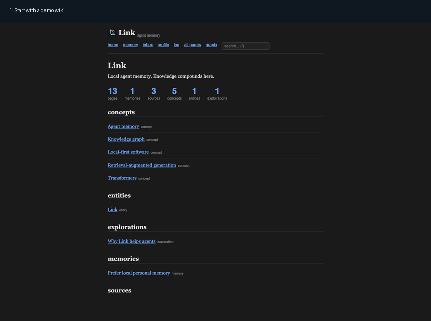
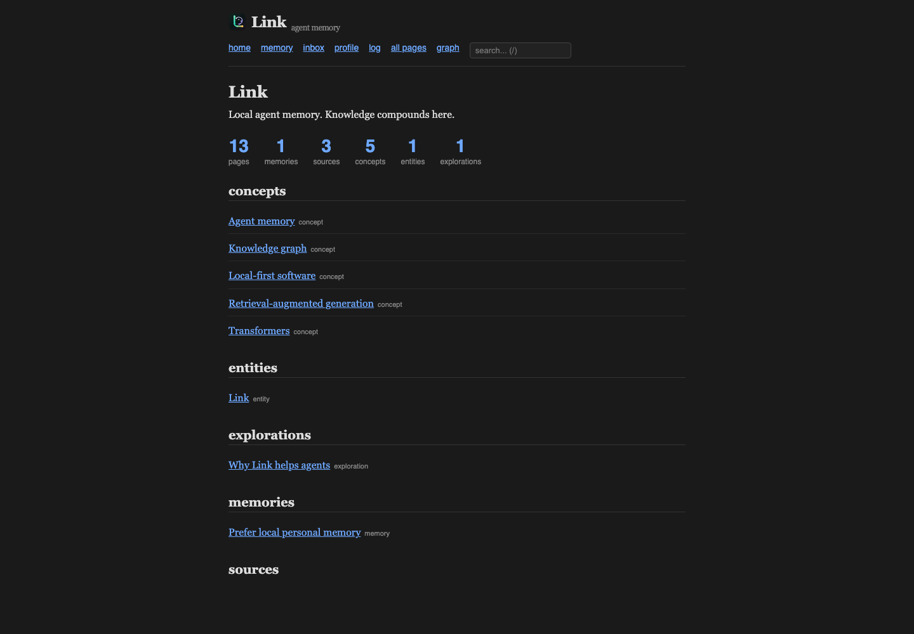
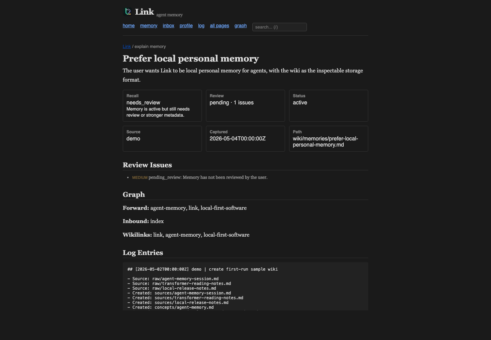

<p align="center">
  
</p>

# Link

**Local, source-backed memory for LLM agents.**

Link gives Codex, Claude, Cursor, Kiro, VS Code, Copilot, and other MCP clients
the same durable memory about you and your work. The memory stays on your
machine as plain Markdown, with sources, backlinks, graph context, and an audit
trail you can inspect.

It follows Andrej Karpathy's [LLM Wiki pattern](https://gist.github.com/karpathy/442a6bf555914893e9891c11519de94f):
keep knowledge outside the chat window, make claims inspectable, and let context
compound over time.

[](https://github.com/gowtham0992/link)
[](https://github.com/gowtham0992/link/actions/workflows/ci.yml)
[](https://registry.modelcontextprotocol.io/?q=io.github.gowtham0992%2Flink)
[](https://pypi.org/project/link-mcp/)

Release notes: [CHANGELOG.md](CHANGELOG.md)

<p align="center">
  
</p>

## Why Link

Most agent sessions start from zero. You re-explain preferences, repo decisions,
project constraints, and why something matters. Link makes that context durable:

- **Personal memory:** preferences, decisions, facts, and project context agents
  can recall later.
- **Source-backed wiki:** raw notes become readable Markdown pages with citations.
- **Graph context:** pages know what links in, what links out, and what sits nearby.
- **MCP-native:** every local agent can use the same memory layer.
- **Local-first:** no hosted backend, no telemetry, no cloud lock-in.
- **Inspectable:** Markdown files, backlinks, logs, and review states are yours.

## Quick Start

Try Link with a finished, pre-ingested wiki:

```bash
git clone https://github.com/gowtham0992/link.git
cd link
python3 link.py demo
cd link-demo
python3 serve.py
```

Open:

- `http://localhost:3000`
- `http://localhost:3000/memory`
- `http://localhost:3000/graph`

Then check the demo:

```bash
python3 link.py doctor .
python3 link.py ingest-status .
```

The demo includes source pages, concept pages, a memory page, backlinks, search,
a graph view, and MCP-ready retrieval.

## What You Get

### Wiki Home

Browse pages by type, search locally, and open the same Markdown pages your
agents use.

<p align="center">
  
</p>

### Memory Dashboard

See what agents can remember, what needs review, and what changed recently.

<p align="center">
  
</p>

### Knowledge Graph

Inspect relationships between source pages, concepts, entities, explorations, and
memories. Dragging a node places it; double-clicking opens it.

<p align="center">
  
</p>

### Explain Memory

Every memory can explain why it exists, whether it is review-ready, and what
source or log evidence supports it.

<p align="center">
  
</p>

## First 10 Minutes

This path turns one real note into local agent memory.

### 1. Install Link For Your Agent

From the cloned `link/` checkout:

```bash
bash integrations/codex/install.sh
```

Pick the installer that matches your agent:

```bash
bash integrations/kiro/install.sh          # Kiro
bash integrations/claude-code/install.sh   # Claude Code
bash integrations/codex/install.sh         # Codex
bash integrations/cursor/install.sh        # Cursor
bash integrations/copilot/install.sh       # Copilot
bash integrations/vscode/install.sh        # VS Code
bash integrations/antigravity/install.sh   # Google Antigravity
```

This creates `~/link/`, installs or upgrades `link-mcp`, writes lightweight agent
instructions, and leaves existing wiki data untouched on reinstall.

Use `--project` if you want memory scoped to the current repo instead of global
memory under `~/link`.

### 2. Add One Source

```bash
cat > ~/link/raw/first-memory.md <<'EOF'
---
title: "First Link memory"
source_type: note
date_captured: 2026-05-04
---

# First Link memory

I am testing Link as local personal memory for agents.
Raw notes stay local. The agent turns them into source-cited wiki pages.
EOF
```

Check what is pending:

```bash
python3 ~/link/link.py ingest-status ~/link
```

### 3. Save One Direct Memory

Use direct memories for preferences, decisions, and project facts future agents
should recall:

```bash
python3 ~/link/link.py remember "I am testing Link as local personal memory for agents." ~/link --type preference --scope user --tags onboarding
python3 ~/link/link.py recall "local personal memory" ~/link
python3 ~/link/link.py profile ~/link
```

### 4. Ask Your Agent To Ingest

In your agent chat:

```text
ingest raw/first-memory.md into Link
```

The agent reads `~/link/LINK.md`, creates a source page under `wiki/sources/`,
creates or updates concept/entity pages, updates `wiki/index.md`, appends
`wiki/log.md`, and rebuilds backlinks.

### 5. Verify The Loop

```bash
python3 ~/link/link.py doctor ~/link --fix
python3 ~/link/link.py ingest-status ~/link
python3 ~/link/link.py verify-mcp ~/link
```

Then ask your MCP-enabled agent:

```text
query Link for first Link memory
```

If the answer comes from Link, your local memory loop is working.

## How Link Works

```text
raw sources -> agent ingest -> Markdown wiki -> backlinks/graph -> MCP recall
                         \
                          -> direct memories -> review/update/archive
```

| Layer | Purpose |
|-------|---------|
| `raw/` | Immutable sources: notes, papers, articles, transcripts, images, PDFs. |
| `wiki/sources/` | One source page per ingested raw file. |
| `wiki/concepts/`, `wiki/entities/`, `wiki/explorations/` | Synthesized knowledge pages with source citations. |
| `wiki/memories/` | Preferences, decisions, project facts, and user context. |
| `wiki/_backlinks.json` | Reverse and forward graph index for HTTP and MCP. |
| `wiki/log.md` | Append-only audit trail of ingest, memory, and maintenance operations. |

You own the files. Agents maintain them.

## Install Paths

### I Want To Try Link

```bash
git clone https://github.com/gowtham0992/link.git
cd link
python3 link.py demo
cd link-demo
python3 serve.py
```

### I Want My Agent To Use Link

Run the installer for your agent:

```bash
bash integrations/codex/install.sh
```

Re-run the same installer after `git pull` to refresh code, instructions, and
MCP setup without replacing your wiki pages.

The installers try the current `python3` first. If that Python is externally
managed, they create `~/.link-mcp-venv`, install `link-mcp` there, and register
MCP with that venv Python.

### I Want MCP Only

Install `link-mcp` and point it at a wiki:

```bash
python3 -m pip install --upgrade link-mcp
```

```json
{
  "mcpServers": {
    "link": {
      "command": "python3",
      "args": ["-m", "link_mcp", "--wiki", "~/link/wiki"]
    }
  }
}
```

On macOS/Homebrew Python, if pip reports `externally-managed-environment`, use a
dedicated venv:

```bash
python3 -m venv ~/.link-mcp-venv
~/.link-mcp-venv/bin/python -m pip install --upgrade pip link-mcp
```

Then use that Python in your MCP config:

```json
{
  "mcpServers": {
    "link": {
      "command": "/Users/YOU/.link-mcp-venv/bin/python",
      "args": ["-m", "link_mcp", "--wiki", "/Users/YOU/link/wiki"]
    }
  }
}
```

### I Want To Develop Link

```bash
python3 -m unittest discover -s tests
python3 scripts/check_release_hygiene.py
python3 scripts/prepare_release.py 1.0.8 --dry-run
```

## Daily Workflow

Add source material:

```bash
cp notes.md ~/link/raw/
python3 ~/link/link.py ingest-status ~/link
```

Ask your agent:

```text
ingest raw/notes.md into Link
```

Remember preferences and decisions directly:

```bash
python3 ~/link/link.py remember "User prefers release/* branches for public release work." ~/link --title "Prefer release branches" --type preference --scope project
python3 ~/link/link.py recall "branch preference" ~/link
python3 ~/link/link.py explain-memory prefer-release-branches ~/link
python3 ~/link/link.py update-memory prefer-release-branches "Use release/* branches for public release work." ~/link
python3 ~/link/link.py review-memory prefer-release-branches ~/link --note "confirmed"
```

Maintain the wiki:

```bash
python3 ~/link/link.py doctor ~/link --fix
python3 ~/link/link.py rebuild-backlinks ~/link
python3 ~/link/link.py verify-mcp ~/link
```

View the wiki:

```bash
cd ~/link
python3 serve.py
```

Obsidian also works: open `~/link/wiki/` as a vault.

## MCP Tools

Link is listed on the [official MCP Registry](https://registry.modelcontextprotocol.io/?q=io.github.gowtham0992%2Flink)
as `io.github.gowtham0992/link`.

Most agents should start with:

| Tool | Use it when |
|------|-------------|
| `memory_profile` | You need to know what Link remembers about the user/project. |
| `recall_memory` | You need preferences, decisions, facts, or project context. |
| `get_context` | You need a topic plus its graph neighborhood. |
| `search_wiki` | You need ranked search across the wiki. |
| `explain_memory` | You need provenance and review state for a memory. |
| `remember_memory` | The user explicitly approves saving a durable memory. |
| `propose_memories` | You want memory candidates from chat/session notes without writing. |

Full tool set: `memory_profile`, `memory_inbox`, `review_memory`,
`explain_memory`, `search_wiki`, `recall_memory`, `remember_memory`,
`propose_memories`, `update_memory`, `archive_memory`, `restore_memory`,
`get_context`, `get_pages`, `get_backlinks`, `get_graph`, `rebuild_backlinks`.

## HTTP API

`serve.py` exposes Link locally while the web viewer is running.

Local use only: `serve.py` binds to `127.0.0.1` and has no authentication. Do not
expose it to the internet without adding auth. Memory write operations stay
CLI/MCP-only; the HTTP proposal endpoint is analysis-only and does not write
memory pages.

Common endpoints:

| Endpoint | Description |
|----------|-------------|
| `GET /api/pages` | All pages with title, type, tags, aliases, maturity, and TLDR. |
| `GET /api/memory-dashboard` | Read-only memory dashboard data. |
| `GET /api/memory-profile` | Counts and recent memories for the local memory profile. |
| `GET /api/memory-inbox` | Memories that need review or metadata cleanup. |
| `GET /api/explain-memory?memory=<name>` | Provenance, lifecycle, graph links, review state, and recall readiness. |
| `POST /api/propose-memories` | Returns memory proposals without writing pages. |
| `GET /api/search?q=<query>` | Ranked search by title, alias, tag, TLDR, and full text. |
| `GET /api/context?topic=<topic>` | Best matching page plus inbound and forward graph links. |
| `GET /api/graph` | Nodes and edges for graph visualization. |
| `POST /api/rebuild-backlinks` | Rebuild `_backlinks.json` by scanning wikilinks. |

## Command Reference

| Command | What it does |
|---------|-------------|
| `python3 link.py demo` | Create `./link-demo` with a pre-ingested sample wiki. |
| `python3 link.py ingest-status <dir>` | Show pending raw files and graph index status. |
| `python3 link.py remember "text" <dir>` | Save a local agent memory; strong duplicates are refused unless `--allow-duplicate` is set. |
| `python3 link.py propose-memories <file-or-text> <dir>` | Propose durable memories from notes without writing them. |
| `python3 link.py recall "query" <dir>` | Search local agent memories. |
| `python3 link.py profile <dir>` | Show what Link remembers by type, scope, status, and recency. |
| `python3 link.py memory-inbox <dir>` | Show memories that need review or stronger metadata. |
| `python3 link.py review-memory <name> <dir>` | Mark a confirmed memory as reviewed. |
| `python3 link.py explain-memory <name> <dir>` | Explain provenance, lifecycle, graph links, review issues, and recall readiness. |
| `python3 link.py update-memory <name> "text" <dir>` | Merge new text into an existing memory and reset review to pending. |
| `python3 link.py archive-memory <name> <dir>` | Reversibly hide a stale or wrong memory from default recall. |
| `python3 link.py restore-memory <name> <dir>` | Restore an archived memory to active recall. |
| `python3 link.py doctor <dir>` | Check structure, graph health, source hygiene, and secret-looking content. |
| `python3 link.py doctor <dir> --fix` | Create missing structure and repair backlinks safely. |
| `python3 link.py rebuild-backlinks <dir>` | Regenerate `wiki/_backlinks.json`. |
| `python3 link.py verify-mcp <dir>` | Verify `link-mcp` import and print MCP config. |

## Privacy And Safety

Link is local-first:

- No telemetry.
- No hosted backend.
- No external API calls from `serve.py` or `link-mcp`.
- Raw sources and generated wiki pages are ignored by git by default.
- Registry token files and common secret-looking files are ignored and checked by release hygiene.

Before sharing a repo, demo, or wiki:

```bash
python3 link.py doctor .
python3 scripts/check_release_hygiene.py
```

Treat `doctor` errors as blockers. Warnings usually mean quality work: missing
summaries, missing source sections, stale source counts, isolated pages, or raw
files not represented in source pages.

Use `git push`, `git archive`, or clean build artifacts for public sharing. Do
not zip a whole working directory; ignored local files, `.git/`, caches, raw
sources, and build outputs can be included by accident.

## Contributing

Contributions should come through pull requests. Please target `develop` unless
the maintainer asks for a different branch. `main` is the release branch.

Before opening a PR, run the local gate:

```bash
python3 -m unittest discover -s tests
python3 -m py_compile link.py serve.py scripts/check_release_hygiene.py scripts/prepare_release.py scripts/smoke_mcp_stdio.py mcp_package/link_mcp/server.py
python3 scripts/check_release_hygiene.py
bash -n integrations/*/install.sh integrations/*/uninstall.sh integrations/_shared/*.sh
python3 link.py demo /tmp/link-mcp-smoke --force
PYTHONPATH=mcp_package python3 scripts/smoke_mcp_stdio.py /tmp/link-mcp-smoke/wiki
git diff --check
```

In the PR description, include:

- What changed.
- How you tested it.
- Whether it touches memory writes, installers, MCP behavior, HTTP endpoints, or release tooling.
- Screenshots or GIFs for UI changes.

Do not include personal wiki data, raw sources, registry tokens, `.env` files, or
local MCP credentials in a PR.

## Maintainer Release

Release publishing is maintainer-only. Contributors do not need PyPI or MCP
Registry credentials.

To prepare release files, run:

```bash
python3 scripts/prepare_release.py 1.0.8
```

This updates the package version files and moves `CHANGELOG.md` `Unreleased`
notes into a dated release section.

After the release PR merges to `main` and CI passes, the maintainer tags and
publishes from a clean `main` checkout. The script prints the exact publish
commands for the selected version:

```bash
git switch main
git pull --ff-only
git tag -a v1.0.8 -m "v1.0.8"
git push origin v1.0.8
```

Never reuse a published PyPI version or move a public release tag. If a release
needs another fix, bump to the next version.

## Project Structure

```text
link/
├── LINK.md              # schema and instructions for agents
├── raw/                 # source documents, ignored by git
├── wiki/                # compiled knowledge, ignored by git except scaffolding
│   ├── index.md         # master catalog
│   ├── _backlinks.json  # reverse and forward link index
│   ├── log.md           # append-only operation history
│   ├── sources/         # one page per ingested source
│   ├── concepts/        # topic articles
│   ├── entities/        # people, orgs, projects
│   ├── memories/        # local agent memory
│   ├── comparisons/     # side-by-side analyses
│   └── explorations/    # filed query results
├── docs/assets/         # README screenshots and GIFs
├── integrations/        # one-step setup per AI tool
├── mcp_package/         # PyPI package for link-mcp and shared link_core
├── scripts/             # release and hygiene tooling
├── serve.py             # local web viewer and HTTP API
└── link.py              # local utility CLI
```

## Design Principles

- Every claim links to a source.
- Confidence tags make uncertainty visible.
- `log.md` records wiki operations.
- Pages mature from seed to established.
- Agents should use MCP `get_context` or `/api/context` before reading files manually.
- The local web viewer has no runtime dependencies beyond Python stdlib.
- The wiki is plain Markdown, so it works with git, Obsidian, and normal editors.
